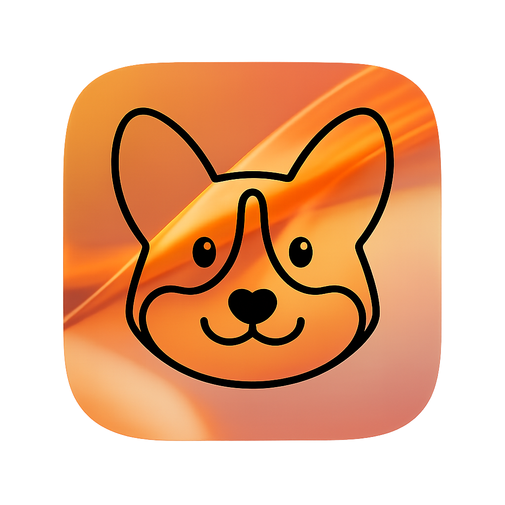

    
    <h1>Corge Notch</h1>

Thaw is a powerful menu bar management tool. While its primary function is hiding and showing menu bar items, it aims to cover a wide variety of additional features to make it one of the most versatile menu bar tools available.

> [!NOTE]
> **Thaw** is a fork of [Ice](https://github.com/jordanbaird/Ice) by Jordan Baird.
> As the original project appears to be inactive, Thaw aims to keep the project alive fixing bugs, ensuring compatibility with the latest macOS releases, and eventually implementing the remaining roadmap features.
